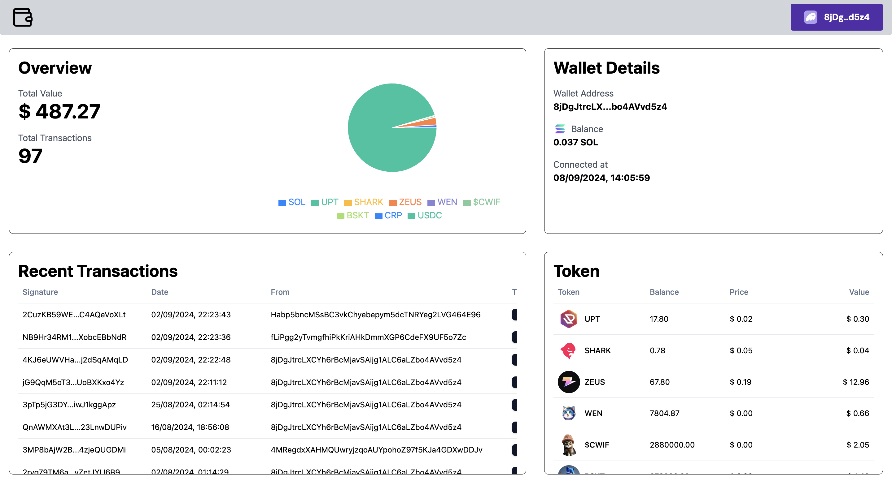
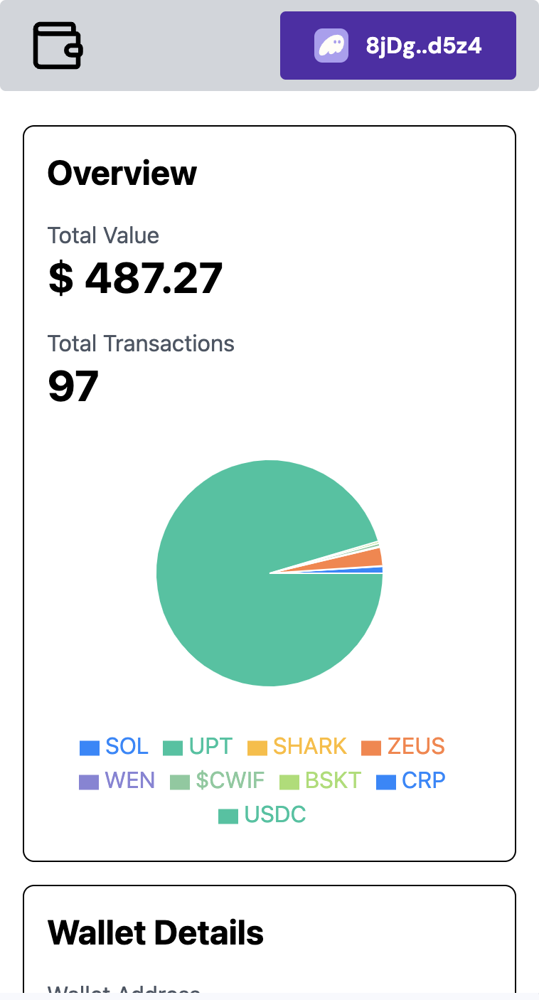

# Solana Wallet Tracker

## Overview

Solana Wallet Tracker is a web application built with Next.js that allows users to track their Solana wallet balance, view transaction history, and monitor token holdings. It leverages the power of Solana's blockchain and provides a user-friendly interface for managing and analyzing your Solana assets.




## Features

- Connect to any Solana wallets
- Display real-time SOL balance
- Show transaction history
- List token holdings with current values
- Visualize portfolio distribution
- Responsive design for desktop and mobile

## Technology Stack

- [Next.js](https://nextjs.org/) - React framework for building the user interface
- [Tailwind CSS](https://tailwindcss.com/) - Utility-first CSS framework for styling
- [shadcn/ui](https://ui.shadcn.com/) - Re-usable components built with Radix UI and Tailwind CSS
- [Solana Web3.js](https://solana-labs.github.io/solana-web3.js/) - Solana JavaScript API
- [Helius API](https://docs.helius.xyz/) - Enhanced Solana API for detailed blockchain data

## Prerequisites

- Node.js (v14 or later)
- npm or yarn
- A Solana wallet (e.g., Phantom, Solflare)
- Helius API key

## Setup

1. Clone the repository:
   ```
   git clone https://github.com/haoxiang14/solana-wallet-checker.git
   cd solana-wallet-tracker
   ```

2. Install dependencies:
   ```
   npm install
   # or
   yarn install
   ```

3. Create a `.env.local` file in the root directory and add your Helius API key:
   ```
   NEXT_PUBLIC_HELIUS_API_KEY=your_helius_api_key_here
   ```

4. Run the development server:
   ```
   npm run dev
   # or
   yarn dev
   ```

5. Open [http://localhost:3000](http://localhost:3000) in your browser to see the application.

## Usage

1. Connect your Solana wallet using the "Connect Wallet" button.
2. Once connected, you'll see your SOL balance, recent transactions, and token holdings.
3. Use the portfolio visualization to get an overview of your asset distribution.
4. Click on transaction hashes/signatures to view more details on Solana Explorer.

## Deployment

To deploy your Solana Wallet Tracker, we recommend using [Vercel](https://vercel.com/), the platform built by the creators of Next.js.

1. Push your code to a GitHub repository.
2. Import your project into Vercel.
3. Set up your environment variables in the Vercel dashboard.
4. Deploy!

